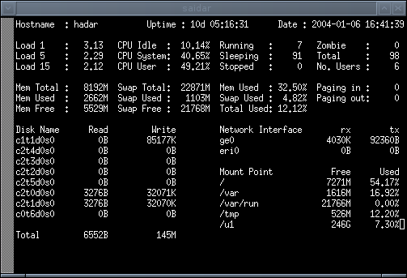

libstatgrab
===========

* [What is libstatgrab?](#what-is-libstatgrab)
* [Current version](#current-version)
* [Downloading](#downloading)
* [Bug reporting and development](#bug-reporting-and-development)
* [Language bindings](#language-bindings)
* [Packages](#packages-of-libstatgrab)
* [Documentation](#documentation)
* [Screenshot](#screenshot)

What is libstatgrab?
--------------------

libstatgrab is a library that provides cross platform access to statistics about the system on which it's run. It's written in C and presents a selection of useful interfaces which can be used to access key system statistics. The current list of statistics includes CPU usage, memory utilisation, disk usage, process counts, network traffic, disk I/O, and more.

The current list of supported and tested platforms includes FreeBSD, Linux, NetBSD, OpenBSD, Solaris, DragonFly BSD, HP-UX and AIX. We are always happy to accept patches to extend support to other operating systems.

The package also includes a couple of useful tools. The first, [saidar](#screenshot), provides a curses-based interface to viewing the current state of the system. The second, statgrab, gives a sysctl-style interface to the statistics gathered by libstatgrab. This extends the use of libstatgrab to people writing scripts or anything else that can't easily make C function calls. Included with statgrab is a script to generate an [MRTG](https://oss.oetiker.ch/mrtg/) configuration file to use statgrab.

The library part of libstatgrab is licensed under the GNU LGPL, but the tools and examples are licensed under the GNU GPL.

Current version
---------------

The current release is [libstatgrab 0.91](https://github.com/libstatgrab/libstatgrab/releases/tag/LIBSTATGRAB_0_91) released on 11 July 2014.

It includes a number of bugfixes and new features but is API compatible with 0.90.

* Use `/proc/mounts` on Linux where available.
* Add a new field named `device_canonical` to the filesystem statistics.
* Fix list miscounting in `sg_set_valid_filesystems`.
* Fix buffer overrun when dealing with a larger number of processes.
* Fix divide by zero display problem in saidar.
* When logging with log4cplus is enabled, properties files are installed in to `${prefix}/etc`.
* Add Graphite output support in statgrab.

A full list of changes can be found in the [NEWS](https://github.com/libstatgrab/libstatgrab/blob/LIBSTATGRAB_0_91/NEWS) file contained within the release.

Downloading
-----------

All versions of libstatgrab can be downloaded from [GitHub](https://github.com/libstatgrab/libstatgrab/releases). Downloads are signed using our key ([download here](/i-scream-dev.asc)):

~~~~
~~~~

For installation instructions see the [README](https://github.com/libstatgrab/libstatgrab/blob/master/README) file contained within the archive.

Bug reporting and development
-----------------------------

If you found a bug or an issue with libstatgrab then you can report it on the project's [GitHub issues](https://github.com/libstatgrab/libstatgrab/issues) page. If you have a fix you can make a pull request there too. Bugs with a detailed description or a fix are likely to be committed sooner.

We're happy to accept patches that fix, improve, or extend libstatgrab.

Language bindings
-----------------

* [Python](/pystatgrab/)
* [PHP](https://pecl.php.net/package/statgrab)
* [Perl](https://metacpan.org/release/Unix-Statgrab)
* [Ruby](https://rubygems.org/gems/statgrab)
* [Haskell](https://hackage.haskell.org/package/statgrab)

Here are links to bindings for higher level languages that provide access to libstatgrab. If you've written a binding for another language, please get in touch so we can add a link here.

Packages of libstatgrab
-----------------------

* [FreeBSD](https://www.freebsd.org/cgi/ports.cgi?query=statgrab&stype=all)
* [Gentoo Linux](https://packages.gentoo.org/package/sys-libs/libstatgrab)
* [Solaris (OpenCSW)](https://www.opencsw.org/packages/libstatgrab_utils/)
* [Debian](https://packages.debian.org/search?suite=all&searchon=names&keywords=statgrab)
* [Ubuntu](https://packages.ubuntu.com/search?suite=all&searchon=names&keywords=statgrab)
* [NetBSD/pkgsrc](http://pkgsrc.se/devel/libstatgrab)
* [openSUSE](https://software.opensuse.org/search?utf8=%E2%9C%93&q=libstatgrab)
* [OpenBSD](https://cvsweb.openbsd.org/cgi-bin/cvsweb/ports/sysutils/libstatgrab/)

These are various pre-packaged versions of libstatgrab that you can get for your favourite operating system. If we've missed any out, please let us know.

We've noticed that Google throws up some RPMs relating to Mandrake and Suse, but no webpage for them.

Documentation
-------------

The only online documentation we have at the moment is the manual pages converted in to HTML format. First are the manual pages for the command line tools:

* [saidar(1)](/docs/saidar.1.html)
* [statgrab(1)](/docs/statgrab.1.html)
* [statgrab-make-mrtg-config(1)](/docs/statgrab-make-mrtg-config.1.html)
* [statgrab-make-mrtg-index(1)](/docs/statgrab-make-mrtg-index.1.html)

We also have an overview page for the library:

* [statgrab(3)](/docs/statgrab.3.html)

Then we have the manual pages for each function:

* [sg_comp_init(3)](/docs/sg_comp_init.3.html)
* [sg_get_cpu_stats(3)](/docs/sg_get_cpu_stats.3.html)
* [sg_get_disk_io_stats(3)](/docs/sg_get_disk_io_stats.3.html)
* [sg_get_error(3)](/docs/sg_get_error.3.html)
* [sg_get_fs_stats(3)](/docs/sg_get_fs_stats.3.html)
* [sg_get_host_info(3)](/docs/sg_get_host_info.3.html)
* [sg_get_load_stats(3)](/docs/sg_get_load_stats.3.html)
* [sg_get_mem_stats(3)](/docs/sg_get_mem_stats.3.html)
* [sg_get_network_iface_stats(3)](/docs/sg_get_network_iface_stats.3.html)
* [sg_get_network_io_stats(3)](/docs/sg_get_network_io_stats.3.html)
* [sg_get_page_stats(3)](/docs/sg_get_page_stats.3.html)
* [sg_get_process_stats(3)](/docs/sg_get_process_stats.3.html)
* [sg_get_user_stats(3)](/docs/sg_get_user_stats.3.html)
* [sg_init(3)](/docs/sg_init.3.html)
* [sg_internal-intro(3)](/docs/sg_internal-intro.3.html)
* [sg_intro(3)](/docs/sg_intro.3.html)
* [sg_lock_mutex(3)](/docs/sg_lock_mutex.3.html)
* [sg_set_error(3)](/docs/sg_set_error.3.html)
* [sg_vector_create(3)](/docs/sg_vector_create.3.html)

Screenshot
----------

Here's what saidar looks like when it's running:

